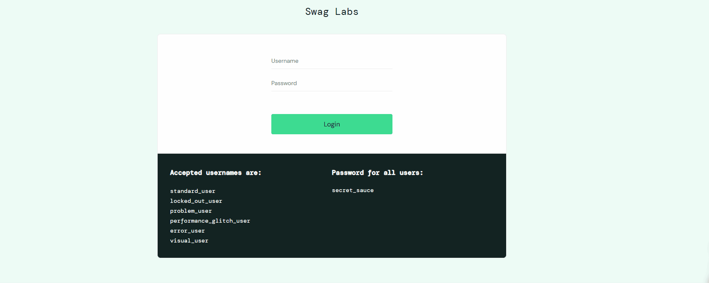
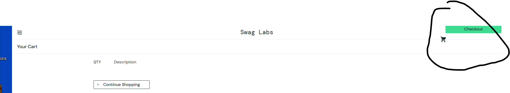
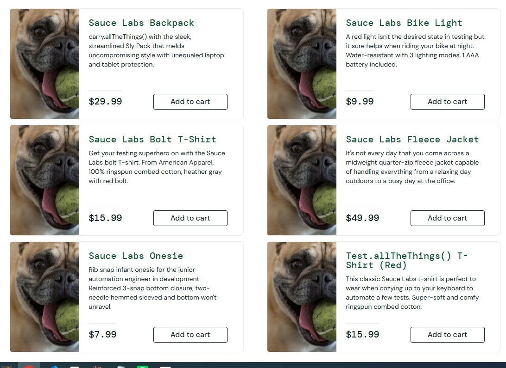
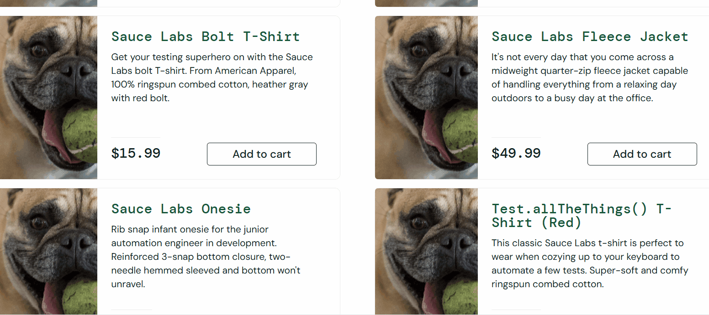
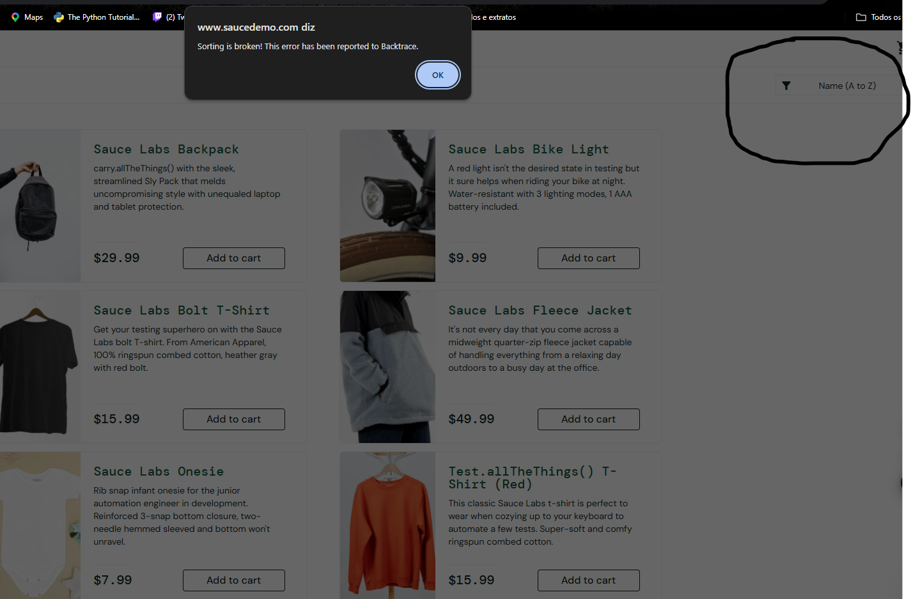
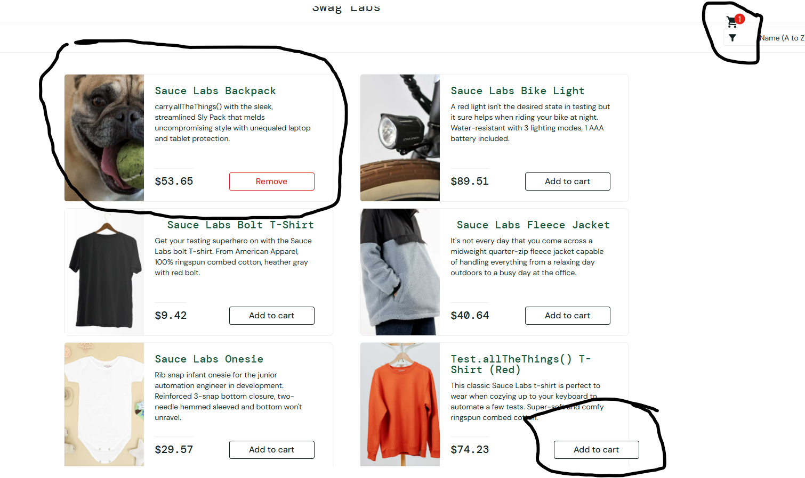

# Desafio Técnico — Estágio em Teste de Software (Mexx / CMTECH)

Testador: Plinio
Aplicação testada: [SauceDemo](https://www.saucedemo.com/)
Data: 24/08/2026

## Nota sobre metodologia

Este material foi montado com apoio de IA (Claude), que ajudou a estruturar os casos de teste, organizar os achados e escrever o esqueleto da automação. Todos os testes exploratórios foram executados ao vivo por mim, no navegador, seguindo um roteiro guiado — cada "Resultado obtido" reflete o que eu de fato observei na aplicação, incluindo dois achados que não estavam previstos no roteiro original (o botão "Generate PDF Order" e o comportamento de preços aleatórios do `visual_user`).

---

## 1. Casos de teste

### TC01 — Login com credenciais válidas
| Campo | Descrição |
|---|---|
| Cenário | Login com usuário e senha válidos (`standard_user`) |
| Passos | 1. Acessar saucedemo.com. 2. Preencher usuário `standard_user`. 3. Preencher senha `secret_sauce`. 4. Clicar em "Login". |
| Resultado esperado | Usuário é redirecionado para a página de produtos (`inventory.html`) |
| Resultado obtido | Usuário foi redirecionado corretamente para `https://www.saucedemo.com/inventory.html`, a página de produtos |
| Status | Passou |
| Evidência |  |

### TC02 — Login com senha inválida
| Campo | Descrição |
|---|---|
| Cenário | Login com usuário válido e senha incorreta |
| Passos | 1. Acessar saucedemo.com. 2. Preencher usuário `standard_user`. 3. Preencher senha `senha_errada`. 4. Clicar em "Login". |
| Resultado esperado | Sistema não realiza login e exibe mensagem de erro informando que usuário e senha não conferem, sem expor qual dos dois campos está incorreto (boa prática de segurança) |
| Resultado obtido | Sistema exibiu a mensagem "Epic sadface: Username and password do not match any user in this service", sem indicar qual dos dois campos estava errado |
| Status | Passou |

### TC03 — Login com campos em branco
| Campo | Descrição |
|---|---|
| Cenário | Tentar login sem preencher usuário nem senha |
| Passos | 1. Acessar saucedemo.com. 2. Deixar usuário e senha em branco. 3. Clicar em "Login". |
| Resultado esperado | Sistema bloqueia o envio e exibe mensagem "Username is required" |
| Resultado obtido | Sistema exibiu a mensagem "Epic sadface: Username is required" |
| Status | Passou |

### TC04 — Login com usuário bloqueado (locked_out_user)
| Campo | Descrição |
|---|---|
| Cenário | Login com um usuário que deveria estar bloqueado pelo sistema |
| Passos | 1. Acessar saucedemo.com. 2. Preencher usuário `locked_out_user`. 3. Preencher senha `secret_sauce`. 4. Clicar em "Login". |
| Resultado esperado | Sistema impede o acesso e exibe mensagem clara informando que o usuário foi bloqueado |
| Resultado obtido | Sistema impediu o login e exibiu a mensagem "Epic sadface: Sorry, this user has been locked out." |
| Status | Passou |

### TC05 — Adicionar produto ao carrinho
| Campo | Descrição |
|---|---|
| Cenário | Adicionar um produto ao carrinho e verificar o contador |
| Passos | 1. Login com `standard_user`. 2. Clicar em "Add to cart" no primeiro produto listado. 3. Observar o ícone do carrinho. |
| Resultado esperado | O botão muda para "Remove" e o ícone do carrinho passa a exibir o número "1" |
| Resultado obtido | O botão mudou para "Remove" e o ícone do carrinho passou a exibir o número "1" |
| Status | Passou |
| Evidência |  |

### TC06 — Checkout completo com dados válidos
| Campo | Descrição |
|---|---|
| Cenário | Fluxo completo de compra, do login até a confirmação do pedido |
| Passos | 1. Login com `standard_user`. 2. Adicionar 1 produto ao carrinho. 3. Ir ao carrinho e clicar em "Checkout". 4. Preencher nome, sobrenome e CEP válidos. 5. Clicar em "Continue". 6. Conferir resumo do pedido. 7. Clicar em "Finish". |
| Resultado esperado | Pedido é concluído e a página exibe a mensagem "Thank you for your order!" com o ícone de confirmação |
| Resultado obtido | Pedido concluído com sucesso, exibindo "Thank you for your order!" com as opções "Back Home" e "Generate PDF Order" |
| Status | Passou |

**Observação:** a tela final tem um botão "Generate PDF Order" que não estava documentado no roteiro original — testado separadamente abaixo (TC06-B).

### TC06-B — Geração de PDF do pedido (caso de teste adicional, descoberto durante a exploração)
| Campo | Descrição |
|---|---|
| Cenário | Verificar se o PDF gerado na tela de confirmação reflete corretamente o pedido feito |
| Passos | 1. Concluir uma compra (TC06). 2. Na tela "Thank you for your order!", clicar em "Generate PDF Order". 3. Abrir o PDF baixado. 4. Conferir se o(s) produto(s) e o valor no PDF batem com o que foi comprado. |
| Resultado esperado | PDF é baixado e exibe corretamente o produto e o valor da compra realizada |
| Resultado obtido | PDF foi baixado, abriu normalmente, e o valor exibido corresponde ao valor do produto adicionado/comprado |
| Status | Passou |

### TC07 — Checkout com campo obrigatório vazio
| Campo | Descrição |
|---|---|
| Cenário | Tentar avançar no checkout sem preencher o sobrenome |
| Passos | 1. Login com `standard_user`. 2. Adicionar 1 produto ao carrinho. 3. Ir ao checkout. 4. Preencher apenas nome e CEP, deixando sobrenome vazio. 5. Clicar em "Continue". |
| Resultado esperado | Sistema não avança e exibe mensagem "Error: Last Name is required" |
| Resultado obtido | Sistema não avançou e exibiu a mensagem "Error: Last Name is required" (confirmado: só avança se todos os campos forem preenchidos) |
| Status | Passou |

### TC08 — Comportamento visual do usuário problem_user
| Campo | Descrição |
|---|---|
| Cenário | Verificar se as imagens dos produtos são exibidas corretamente para o usuário `problem_user` |
| Passos | 1. Login com `problem_user` / `secret_sauce`. 2. Observar as imagens de todos os produtos na página de inventário. |
| Resultado esperado | Cada produto exibe sua própria imagem, todas diferentes entre si |
| Resultado obtido | Todos os produtos exibem a mesma imagem (um cachorro segurando uma bola na boca), em vez da imagem real de cada item |
| Status | Falhou |

### TC08-B — Adicionar ao carrinho todos os produtos (problem_user)
| Campo | Descrição |
|---|---|
| Cenário | Verificar se todos os produtos podem ser adicionados ao carrinho normalmente |
| Passos | 1. Login com `problem_user`. 2. Tentar clicar em "Add to cart" em cada um dos 6 produtos da lista. |
| Resultado esperado | Todos os 6 produtos podem ser adicionados ao carrinho normalmente |
| Resultado obtido | Apenas 3 dos 6 produtos puderam ser adicionados (Sauce Labs Backpack, Sauce Labs Bike Light e Sauce Labs Onesie). Os outros 3 produtos não respondem ao clique em "Add to cart" |
| Status | Falhou |

### TC08-C — Remover produto direto na tela de inventário (problem_user)
| Campo | Descrição |
|---|---|
| Cenário | Verificar se o botão "Remove" funciona na própria tela de produtos (inventory), sem precisar entrar no carrinho |
| Passos | 1. Login com `problem_user`. 2. Adicionar um dos produtos que funciona (ex: Sauce Labs Backpack). 3. Clicar no botão "Remove" que aparece no lugar do "Add to cart", ainda na tela de inventário. |
| Resultado esperado | O item é removido do carrinho e o botão volta a exibir "Add to cart" |
| Resultado obtido | O botão "Remove" na tela de inventário não funciona — o item só pôde ser removido entrando na tela do carrinho e clicando em "Remove" por lá |
| Status | Falhou |

### TC08-D — Campo "Last Name" no checkout (problem_user)
| Campo | Descrição |
|---|---|
| Cenário | Verificar se é possível digitar corretamente no campo "Last Name" da tela de checkout |
| Passos | 1. Login com `problem_user`. 2. Adicionar um produto válido ao carrinho e ir até o checkout. 3. Clicar no campo "Last Name" e tentar digitar um sobrenome. |
| Resultado esperado | O texto digitado aparece corretamente no campo "Last Name" |
| Resultado obtido | Ao digitar no campo "Last Name", o texto é inserido no campo "First Name" (o foco/digitação "sobe" para o campo errado) |
| Status | Falhou |

### TC09 — Ordenação de preços (Price: low to high)
| Campo | Descrição |
|---|---|
| Cenário | Verificar se a ordenação por preço funciona corretamente com `problem_user` |
| Passos | 1. Login com `problem_user`. 2. No dropdown de ordenação, selecionar "Price (low to high)". 3. Conferir a ordem dos preços exibidos. |
| Resultado esperado | Produtos ficam ordenados do menor para o maior preço |
| Resultado obtido | A lista de produtos não muda de ordem ao selecionar "Price (low to high)" nem "Price (high to low)" — os preços continuam na mesma ordem de antes, como se a ordenação não tivesse sido aplicada |
| Status | Falhou |

### TC10 — Tempo de resposta com performance_glitch_user
| Campo | Descrição |
|---|---|
| Cenário | Medir o tempo de carregamento após login com um usuário conhecido por lentidão |
| Passos | 1. Acessar saucedemo.com. 2. Login com `performance_glitch_user` / `secret_sauce`. 3. Cronometrar o tempo entre o clique em "Login" e o carregamento completo da página de produtos. |
| Resultado esperado | Carregamento em tempo similar ao `standard_user` (poucos segundos) |
| Resultado obtido | Login com `standard_user` levou ~0,44s; login com `performance_glitch_user` levou ~7,1s até a tela de produtos carregar — um atraso muito perceptível |
| Status | Falhou |

**Observação:** tirando a lentidão do login, o resto do fluxo com `performance_glitch_user` funcionou normalmente: todos os produtos podem ser adicionados/removidos na própria tela de inventário, a ordenação por preço (low to high / high to low) funciona corretamente — só que com um retardo perceptível para aplicar a mudança — e a remoção de itens pelo carrinho funciona normalmente, com o contador atualizando certinho.

### TC11 — Remoção de item do carrinho com error_user
| Campo | Descrição |
|---|---|
| Cenário | Verificar se é possível remover um item do carrinho com o usuário `error_user` |
| Passos | 1. Login com `error_user`. 2. Adicionar 2 produtos ao carrinho. 3. Ir ao carrinho. 4. Clicar em "Remove" em um dos itens. |
| Resultado esperado | O item é removido da lista e o contador do carrinho é atualizado |
| Resultado obtido | Dentro da tela do carrinho, o botão "Remove" funciona normalmente — o item some da lista e o contador atualiza corretamente |
| Status | Passou |

**Observação:** `error_user` se mostrou parecido com `problem_user` em vários pontos, mas com diferenças importantes: apenas 3 dos 6 produtos podem ser adicionados ao carrinho, os itens NÃO podem ser removidos direto na tela de inventário (home) — só pelo carrinho, que funciona normalmente —, a ordenação por preço chega a gerar um erro (diferente do `problem_user`, que só ignora a ordenação), o campo "Last Name" no checkout não funciona, e a compra não é finalizada sem exibir nenhuma mensagem de erro explicando o motivo. Ver problemas 8 a 11 abaixo.

### TC12 — Inspeção visual e de dados (visual_user)
| Campo | Descrição |
|---|---|
| Cenário | Comparar a tela de produtos e o comportamento da ordenação por preço com o `standard_user` |
| Passos | 1. Login com `visual_user` / `secret_sauce`. 2. Observar imagens e preços dos produtos na tela de inventário. 3. Usar o dropdown de ordenação para selecionar "Price (low to high)" e depois "Price (high to low)", observando o que muda. |
| Resultado esperado | Layout e imagens iguais ao `standard_user`; preços corretos e fixos; ordenação reflete os preços reais |
| Resultado obtido | Imagens desalinhadas e uma delas trocada por uma foto de cachorro (misturada entre as fotos corretas dos outros itens); preços exibidos incorretos; ao clicar para ordenar por preço, os valores mudam para números aparentemente aleatórios a cada clique — a imagem do cachorro, por exemplo, permanece fixa na primeira posição, mas o preço ao lado dela muda toda vez que a ordenação é acionada |
| Status | Falhou |

---

## 2. Problemas encontrados

### 1. Imagens erradas em todos os produtos (problem_user)
- Como reproduzir: fazer login com `problem_user` / `secret_sauce` e observar a tela de produtos (inventory).
- Resultado esperado: cada produto exibe sua própria imagem.
- Resultado obtido: todos os produtos exibem a mesma imagem (um cachorro segurando uma bola na boca), em vez da foto real de cada item.
- Evidência: 
- Severidade sugerida: alta — compromete diretamente a experiência de compra, o usuário não consegue visualizar o que está comprando.

### 2. Metade dos produtos não pode ser adicionada ao carrinho (problem_user)
- Como reproduzir: login com `problem_user`, tentar clicar em "Add to cart" em cada um dos 6 produtos da lista.
- Resultado esperado: todos os produtos podem ser adicionados normalmente.
- Resultado obtido: apenas 3 de 6 produtos respondem ao clique (Sauce Labs Backpack, Sauce Labs Bike Light, Sauce Labs Onesie); os outros 3 não podem ser adicionados ao carrinho.
- Evidência: [adicionar print]
- Severidade sugerida: alta — impede a compra de metade do catálogo.

### 3. Botão "Remove" não funciona na tela de inventário (problem_user)
- Como reproduzir: login com `problem_user`, adicionar um produto que funciona (ex: Sauce Labs Backpack), clicar em "Remove" ainda na tela de inventário (sem entrar no carrinho).
- Resultado esperado: o item é removido do carrinho e o botão volta a "Add to cart".
- Resultado obtido: o clique em "Remove" na tela de inventário não tem efeito; só é possível remover o item entrando na tela do carrinho.
- Evidência: 
- Severidade sugerida: média — existe um caminho alternativo funcional (remover pelo carrinho), mas o botão principal não funciona.

### 4. Campo "Last Name" insere texto no campo errado (problem_user)
- Como reproduzir: login com `problem_user`, ir até o checkout, clicar no campo "Last Name" e digitar um sobrenome.
- Resultado esperado: o texto digitado aparece no campo "Last Name".
- Resultado obtido: o texto digitado é inserido no campo "First Name" em vez do "Last Name".
- Evidência: ver o mesmo GIF do problema #3 acima (`evidencias/problem_user_remove_e_lastname.gif`) — mostra os dois bugs em sequência.
- Severidade sugerida: alta — impede a finalização da compra corretamente para esse usuário, já que o campo obrigatório nunca é preenchido de fato.

### 5. Ordenação por preço não funciona (problem_user)
- Como reproduzir: login com `problem_user`, na tela de produtos usar o dropdown de ordenação e selecionar "Price (low to high)" ou "Price (high to low)".
- Resultado esperado: a lista de produtos é reordenada do menor para o maior preço (ou vice-versa).
- Resultado obtido: a lista permanece na mesma ordem, independente da opção de ordenação selecionada.
- Evidência: [adicionar print]
- Severidade sugerida: média — atrapalha a navegação/comparação de preços, mas não impede a compra.

### 6. Atraso significativo no carregamento após login (performance_glitch_user)
- Como reproduzir: fazer login com `performance_glitch_user` / `secret_sauce` e cronometrar o tempo até a tela de produtos carregar.
- Resultado esperado: tempo de carregamento similar ao `standard_user` (menos de 1 segundo).
- Resultado obtido: `standard_user` levou ~0,44s; `performance_glitch_user` levou ~7,1s — quase 16x mais lento.
- Evidência: cronometragem manual (adicionar gravação de tela, se possível, para reforçar)
- Severidade sugerida: média/alta — dependendo do contexto de negócio, uma demora de 7s no login pode levar o usuário a desistir ou pensar que o site travou.

### 7. Lentidão ao aplicar ordenação por preço (performance_glitch_user)
- Como reproduzir: login com `performance_glitch_user`, na tela de produtos mudar a ordenação para "Price (low to high)" ou "Price (high to low)".
- Resultado esperado: a lista é reordenada de forma fluida, sem atraso perceptível.
- Resultado obtido: a ordenação funciona corretamente, mas há um retardo perceptível para a lista mudar de ordem — coerente com o tema desse usuário (glitch de performance).
- Evidência: [adicionar gravação de tela, já que é um problema de tempo]
- Severidade sugerida: baixa — não impede o uso, mas passa sensação de lentidão/travamento.

### 8. Metade dos produtos não pode ser adicionada ao carrinho (error_user)
- Como reproduzir: login com `error_user`, tentar clicar em "Add to cart" em cada um dos 6 produtos.
- Resultado esperado: todos os produtos podem ser adicionados normalmente.
- Resultado obtido: apenas 3 de 6 produtos respondem ao clique — mesmo padrão encontrado no `problem_user`.
- Evidência: [adicionar print]
- Severidade sugerida: alta — impede a compra de metade do catálogo.

### 9. Botão "Remove" não funciona na tela de inventário (error_user)
- Como reproduzir: login com `error_user`, adicionar um dos produtos que funciona, tentar clicar em "Remove" ainda na tela de inventário.
- Resultado esperado: o item é removido do carrinho direto pela home.
- Resultado obtido: o clique em "Remove" na tela de inventário não remove o item.
- Evidência: [adicionar print]
- Severidade sugerida: média.

### 10. Ordenação por preço gera erro (error_user)
- Como reproduzir: login com `error_user`, na tela de produtos selecionar "Price (low to high)" ou "Price (high to low)".
- Resultado esperado: a lista é reordenada sem problemas.
- Resultado obtido: a aplicação apresenta um alerta de erro do navegador: **"Sorting is broken! This error has been reported to Backtrace."** (diferente do `problem_user`, que simplesmente ignora a ordenação sem erro visível — aqui chega a dar um erro explícito).
- Evidência: 
- Severidade sugerida: média/alta — comportamento de erro explícito, reportado até para um serviço de rastreamento ("Backtrace"), indica uma falha não tratada na aplicação.

### 11. Checkout não valida nem finaliza com Last Name vazio (error_user)
- Como reproduzir: login com `error_user`, ir ao checkout, deixar o campo "Last Name" vazio, clicar em "Continue"/tentar finalizar a compra.
- Resultado esperado: sistema bloqueia o avanço e exibe "Error: Last Name is required" (mesmo comportamento do `standard_user`, TC07).
- Resultado obtido: o campo "Last Name" não funciona corretamente e a compra não é finalizada, mas sem exibir nenhuma mensagem de erro explicando o motivo — o usuário fica sem entender por que não consegue concluir a compra.
- Evidência: [adicionar print]
- Severidade sugerida: alta — falha silenciosa é pior que uma mensagem de erro clara, porque o usuário não sabe o que fazer para corrigir.

### 12. Layout desalinhado e imagem trocada (visual_user)
- Como reproduzir: login com `visual_user` / `secret_sauce`, observar a tela de produtos.
- Resultado esperado: layout e imagens idênticos ao `standard_user`.
- Resultado obtido: imagens desalinhadas, e uma das fotos de produto aparece trocada por uma foto de cachorro, misturada entre as imagens corretas dos demais itens.
- Evidência: [adicionar print comparando com a tela do standard_user]
- Severidade sugerida: média — não impede a compra, mas prejudica a credibilidade visual da loja.

### 13. Preços incorretos e aleatórios ao ordenar (visual_user)
- Como reproduzir: login com `visual_user`, observar os preços na tela de produtos, depois clicar repetidamente em "Price (low to high)" / "Price (high to low)".
- Resultado esperado: preços corretos e estáveis, mudando apenas de posição (não de valor) ao ordenar.
- Resultado obtido: os preços já aparecem incorretos antes de qualquer ordenação, e a cada clique no seletor de ordenação os valores exibidos mudam para números aparentemente aleatórios — inclusive para produtos que não mudam de posição na lista (ex: o item com a foto de cachorro permanece fixo na primeira posição, mas seu preço muda a cada clique).
- Evidência: 
- Severidade sugerida: alta — exibir preço errado/instável para o cliente é um problema sério em um e-commerce real (risco de cobrança incorreta e perda de confiança).

### TC13 — Proteção de rota após logout (botão voltar do navegador)
| Campo | Descrição |
|---|---|
| Cenário | Verificar se a aplicação protege a página de produtos contra acesso via cache do navegador após logout |
| Passos | 1. Fazer login com qualquer usuário. 2. Fazer logout. 3. Clicar no botão "Voltar" do navegador. |
| Resultado esperado | O sistema não permite visualizar a página autenticada; redireciona para o login ou bloqueia o acesso |
| Resultado obtido | O sistema exibiu a mensagem "Epic sadface: You can only access '/inventory.html' when you are logged in.", bloqueando corretamente o acesso |
| Status | Passou |

---

## 3. Análise do cenário

**Situação:** durante o teste do processo de compra, ao finalizar o pedido o sistema apresenta uma mensagem de erro, mas aparentemente o pedido foi criado mesmo assim.

Meus próximos passos para investigar essa situação seriam:

**1. Reproduzir e isolar o problema.** Primeiro eu tentaria reproduzir o erro de forma consistente, repetindo exatamente os mesmos passos (mesmo usuário, mesmos produtos, mesmos dados de checkout) para saber se é um comportamento sistemático ou intermitente. Isso já muda bastante a investigação: um erro que acontece sempre é mais fácil de rastrear do que um que aparece só às vezes (o que pode indicar problema de concorrência, timeout ou race condition).

**2. Confirmar se o pedido foi realmente criado.** "Aparentemente foi criado" precisa virar uma certeza. Eu verificaria isso de duas formas: pela interface (por exemplo, se existisse um histórico de pedidos ou uma confirmação por e-mail) e, se eu tivesse acesso, diretamente no banco de dados ou via chamada à API para ver se o registro do pedido existe, com quais dados e em qual status.

**3. Olhar o que aconteceu "por baixo do capô".** Eu abriria as ferramentas de desenvolvedor do navegador (aba Network e Console) durante uma nova tentativa, para ver: qual requisição foi feita ao finalizar o pedido, qual foi a resposta do servidor (código de status HTTP, corpo da resposta), se houve algum erro de JavaScript no console, e se a mensagem de erro exibida na tela é uma mensagem genérica de front-end ou reflete de fato uma resposta de erro vinda do back-end.

**4. Verificar se é um problema de exibição (falso negativo) ou um problema real de dados.** Existe uma diferença importante entre "o sistema mostrou um erro por engano, mas está tudo certo" (um bug de UI/mensagem) e "o pedido foi criado de forma incompleta, duplicada ou inconsistente" (um bug mais sério, que pode gerar cobrança indevida, estoque incorreto, ou pedido duplicado). Eu tentaria descobrir em qual desses dois grupos o problema se encaixa, porque a gravidade e a urgência são bem diferentes.

**5. Testar variações.** Eu tentaria reproduzir o erro variando alguns fatores: usuários diferentes, produtos diferentes, quantidades diferentes, conexão de rede mais lenta (para simular timeout), múltiplas tentativas seguidas (para testar duplo clique ou duplo envio). Isso ajuda a isolar se o problema está ligado a um caso específico ou é generalizado.

**6. Verificar se o pedido pode ser duplicado.** Um cenário clássico nesse tipo de erro é o usuário, ao ver a mensagem de erro, tentar finalizar a compra de novo — o que pode gerar dois pedidos criados para uma única intenção de compra. Eu testaria especificamente esse caminho.

**7. Documentar tudo e comunicar com clareza.** Eu registraria passos exatos de reprodução, a mensagem de erro completa (com print/gravação), a evidência de que o pedido foi criado (com print ou dado do banco/API), a requisição e resposta relevantes, e classificaria a severidade — porque criar um pedido válido mas informar erro ao usuário é um problema sério: o cliente pode desistir da compra, tentar de novo e ser cobrado duas vezes, ou simplesmente perder a confiança no site. Eu levaria isso para o time de desenvolvimento com o máximo de contexto possível para acelerar a correção.

Resumindo: a ideia central é não aceitar “aparentemente foi criado” como resposta — reproduzir, confirmar com dados concretos (não só pela tela), investigar a comunicação entre front-end e back-end, e entender se é um problema de mensagem ou um problema real de integridade dos dados.

---

## 4. API (opcional)

**API testada:** [Restful Booker](https://restful-booker.herokuapp.com/) (`https://restful-booker.herokuapp.com`)

**Endpoint escolhido:** `GET /booking` — retorna a lista de todas as reservas cadastradas no sistema.

**Requisição executada:** acessei a URL diretamente pelo navegador (`https://restful-booker.herokuapp.com/booking`).

**Resposta obtida:** um array JSON com milhares de objetos, cada um contendo apenas o campo `bookingid` (ex: `[{"bookingid": 1}, {"bookingid": 2}, ...]`), sem erros — a API respondeu corretamente com a listagem.

**O que eu verificaria para saber se essa API está funcionando corretamente:**
- **Código de status HTTP**: se a resposta veio com o código esperado (200 OK para uma listagem bem-sucedida).
- **Formato e estrutura dos dados**: se o retorno é realmente um array JSON válido, e se cada item tem o campo `bookingid` no formato certo (número, não nulo, não duplicado).
- **Consistência**: se chamar o endpoint de novo, os dados continuam coerentes (não somem IDs aleatoriamente, por exemplo).
- **Tempo de resposta**: se a API responde em um tempo aceitável, mesmo com uma lista grande de resultados.
- **Tratamento de erro**: o que acontece se eu pedir um recurso que não existe, ou mandar uma requisição mal formada — se ela responde com um erro claro (ex: 404) em vez de travar ou devolver algo genérico.

**Comparando com a documentação oficial da API:**

- **`GET /booking`** — a documentação diz que deve retornar um array de objetos `{"bookingid": N}`. Foi exatamente o que recebi. ✅ Comportamento correto.
- **`GET /ping`** — a documentação confirma que a resposta esperada é `HTTP/1.1 201 Created` (não 200 OK, como seria o padrão em outras APIs). O 201 que recebi bate certinho com o documentado — não é um bug, é assim mesmo por design. Vale destacar porque é um comportamento fora do convencional (a maioria dos health checks usa 200), e só descobri que era intencional comparando com a documentação, não supondo.
- **`GET /booking/1`** — aqui encontrei uma divergência real: a documentação promete retornar um objeto com os dados da reserva (`firstname`, `lastname`, `totalprice`, `bookingdates`, etc.), mas a resposta que recebi foi **"I'm a Teapot"** (código HTTP 418) em vez dos dados esperados. Isso é uma diferença entre o que a API documenta e o que ela realmente entrega nesse endpoint específico — possivelmente alguma proteção contra tráfego automatizado/bots, já que encontrei relatos públicos de que essa API sofreu abuso de bots no passado.

Isso mostra bem o valor de testar contra a documentação oficial em vez de só supor: o "201 Created" do `/ping` parecia estranho à primeira vista, mas na verdade está correto; já o "418" do `/booking/1` parecia só uma curiosidade, mas na verdade é uma divergência real do que está documentado.

---

## 5. Automação

Escolhi **Playwright com Python (pytest-playwright)** como ferramenta, por ser a linguagem que eu conheço e me sinto confortável para explicar e defender. Fiz dois scripts, do mais simples ao mais completo:

**`automacao/test_login_carrinho.py`** — automação do fluxo de **login + adicionar produto ao carrinho** (TC01 + TC05):
1. Abre o SauceDemo
2. Faz login com `standard_user` / `secret_sauce`
3. Confirma que foi redirecionado para a página de produtos
4. Clica em "Add to cart" no primeiro produto
5. Confirma que o ícone do carrinho passa a exibir "1"

Resultado real da execução:
```
platform win32 -- Python 3.14.7, pytest-9.1.1, pluggy-1.6.0
collected 1 item
test_login_carrinho.py .                                                               [100%]
======================================= 1 passed in 6.14s =======================================
```

**`automacao/test_compra_completa.py`** — automação do fluxo completo de compra (TC06 + TC06-B), com uma verificação em cada etapa (login, adicionar ao carrinho, checkout, preenchimento dos dados, conferência de que o total bate com subtotal + taxa, finalização do pedido e geração do PDF). Se qualquer passo não acontecer como esperado, o teste para exatamente ali e reporta o motivo.

Como rodar (qualquer um dos dois scripts):
```bash
cd automacao
pip install pytest-playwright
python -m playwright install chromium
python -m pytest test_login_carrinho.py
python -m pytest test_compra_completa.py
```

Pra ver rodando com o navegador visível e mais devagar (bom pra demonstrar ao vivo):
```bash
python -m pytest test_compra_completa.py --headed --slowmo 2000
```

---

## 6. Qual foi o cenário mais interessante?

O cenário mais interessante para mim foi o do `visual_user`. O nome do usuário sugere que o problema seria só visual — os desalinhamentos de layout e a imagem trocada, que são os bugs "esperados" pelo próprio nome. Mas ao testar a fundo, encontrei algo que acho que nem era a intenção original: os preços mudam para valores aleatórios toda vez que você aciona a ordenação, inclusive no mesmo item, que continua na mesma posição da lista. Isso não é um problema só de aparência, é um problema de dados/confiabilidade da informação exibida — algo que dificilmente seria pego só olhando rápido pra tela, e que exigiu eu comparar valores entre cliques pra perceber o padrão. Achei esse o achado que mais mostra a diferença entre "só olhar" e realmente testar.

---

## Observações finais (checklist antes de entregar)

- [x] Evidências adicionadas para: TC01 (login), TC05/TC06 (carrinho), problema #1 (imagens de cachorro), #3/#4 (remove + last name, GIF), #10 (erro de ordenação do error_user), #13 (preços aleatórios do visual_user).
- [ ] Ainda faltam prints para os problemas #2, #6 (metade dos produtos não adiciona — problem_user e error_user), #7 (lentidão na ordenação do performance_glitch_user), #9 (remove não funciona na home do error_user), #11 (checkout não valida do error_user) e #12 (layout desalinhado do visual_user). Não são obrigatórios, mas reforçam a entrega — se sobrar tempo, vale capturar.
- [x] Automação rodada localmente e confirmada: `1 passed in 6.14s` (`automacao/test_login_carrinho.py`).
- [ ] Revisar o texto geral e apagar esta seção de checklist antes do envio final.
- [x] Parte opcional de API (Restful Booker) feita — ver seção 4.
